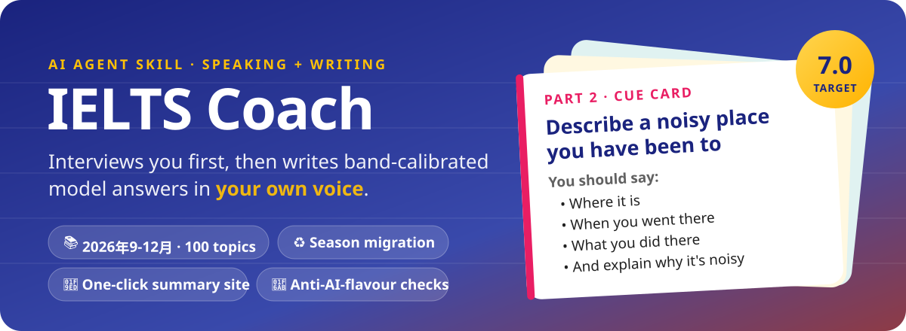
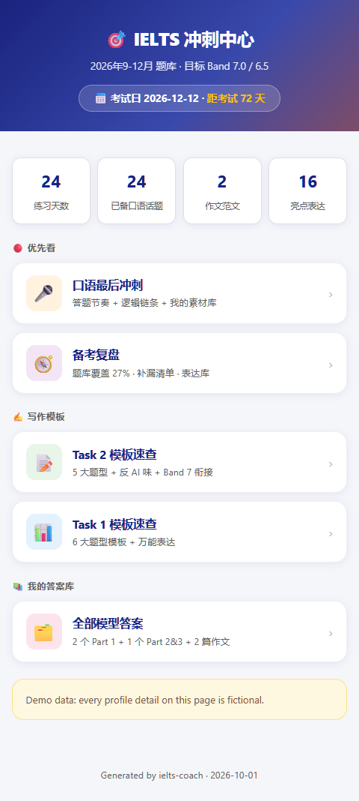
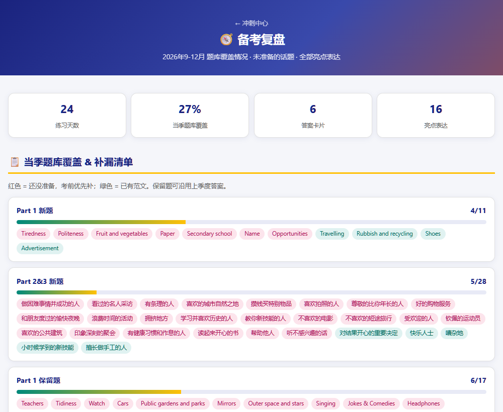
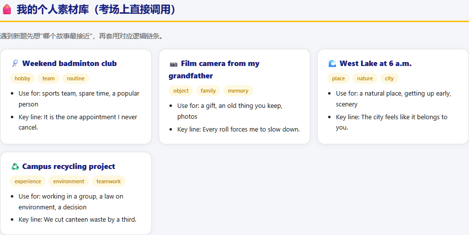
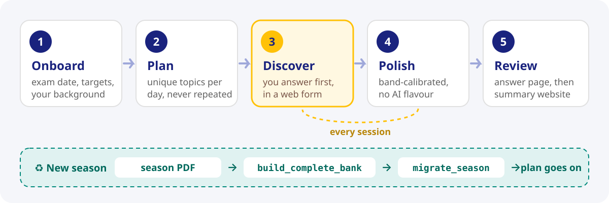
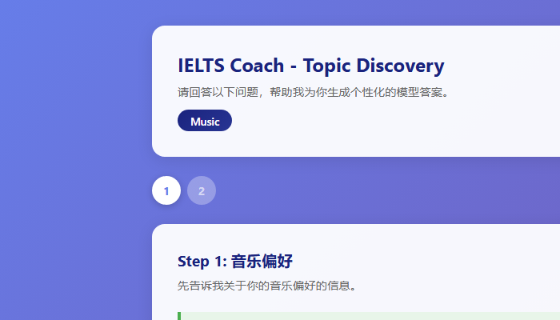
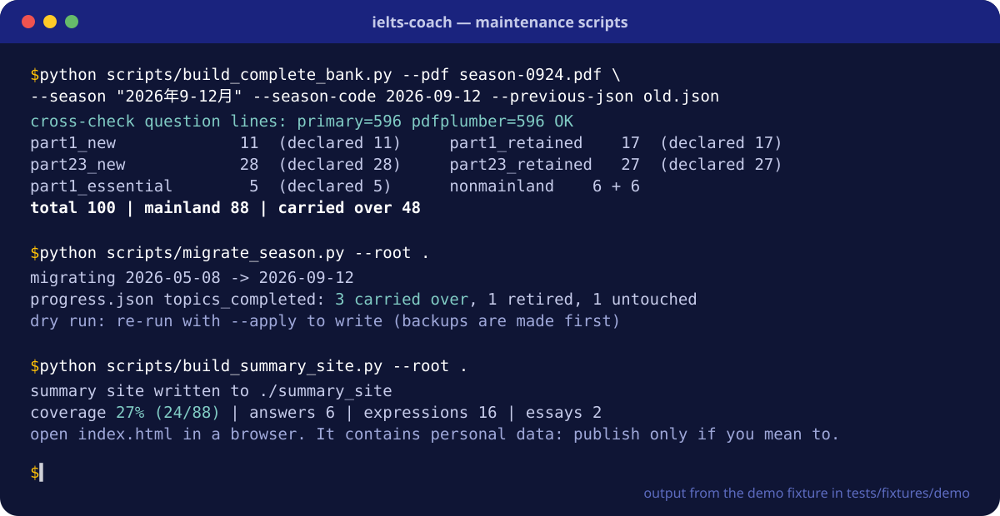

<p align="center">
  
</p>

<p align="center">
  
  
  
  
</p>

<p align="center">简体中文 · <a href="README.md">English</a></p>

IELTS Coach 是一个雅思口语和写作的 agent 技能。写范文之前，它先问你真实的经历和想法，再把你的原话打磨成符合目标分数的答案，统一收进一个本地 HTML 页面。备考周期结束时，它能把你练过的全部内容一键生成一个备考总结网站。

## 你会得到什么

<table>
<tr>
<td width="50%"></td>
<td width="50%"><br><br></td>
</tr>
</table>

<sub>截图使用 <code>tests/fixtures/demo</code> 里的虚构考生数据。</sub>

- **用你的话写范文。** 每个话题先做「话题挖掘」：本地网页表单（或直接在对话里）问你真实的想法和回忆，范文是在这之上打磨出来的，所以好背。
- **按目标分校准。** 词汇、句式和衔接对应目标分段的评分标准；作文对照官方写作评分标准（2023 年 5 月版）和一份反 AI 味清单（不用破折号，不写 Firstly/Secondly/Finally）。
- **计划不重复。** 话题按你可用的天数分配，JSON 状态文件跨会话记录进度。
- **当季题库。** 2026 年 9-12 月（截止 9 月 24 日），100 个口语话题，直接从题库 PDF 解析。
- **换季迁移。** 新题库到了以后，保留下来的话题如果你已经准备过，照样算完成。
- **一键备考总结网站。** 倒计时首页、带个人素材卡的口语冲刺页、Task 1/Task 2 模板速查、题库覆盖复盘和补漏清单，以及可搜索的亮点表达库。

## 工作流程

<p align="center"></p>

<p align="center"></p>

## 快速上手

1. 把这个仓库地址发给你的 agent，让它帮你安装；或者手动复制：
   ```bash
   git clone https://github.com/RomainCHEN/ielts-coach.git
   cp -r ielts-coach/ielts-coach <你的项目>/.claude/skills/   # Claude Code
   # 其他 agent：把 ielts-coach/ 复制到对应的 skills 目录
   ```
2. 在项目里说「开始备考」。agent 会问考试日期、目标小分和你的背景，然后给出计划。
3. 每天说「开始今天的练习」，打开 `ielts_answers.html` 复习。
4. 最后说「生成备考总结网站」，打开 `summary_site/index.html`。

环境要求：脚本需要 Python 3.10+。只有从 PDF 重建题库时才需要 `pip install pymupdf`（装了 `pdfplumber` 会额外做一次交叉校验）。给不支持看图的模型用的视觉桥接需要 `pip install mcp httpx`。

## 题库

| 部分 | 话题数 |
|---|---|
| Part 1 新题 / 保留题 / 万年老题 | 11 / 17 / 5 |
| Part 2&3 新题 / 保留题 | 28 / 27 |
| 非大陆 Part 1 / Part 2&3 | 6 / 6 |
| **大陆考生 / 全部** | **88 / 100** |

题库在 [`ielts-coach/references/question_bank_complete.json`](ielts-coach/references/question_bank_complete.json)（给 agent 用）和 [`question-bank.md`](ielts-coach/references/question-bank.md)（给你看）。其中 48 个话题标注了从 2026 年 5-8 月题库沿用。

### 更新到新一季题库

<p align="center"></p>

```bash
python ielts-coach/scripts/build_complete_bank.py --pdf "<题库>.pdf" \
  --season "2027年1-4月" --season-code 2027-01-04 --cutoff 2027-01-20 \
  --previous-json old/question_bank_complete.json --previous-md old/question-bank.md
python ielts-coach/scripts/migrate_season.py --root .          # 先预演，再加 --apply
```

只要任何一部分的解析数量和 PDF 目录里写的数量对不上，构建器就不会写文件。扫描版 PDF 没有文字层，需要先 OCR（例如 MinerU），再用 `--text` 传入文本。

## 你的数据只在本地

`user_profile.json`、`study_plan.json`、`progress.json`、`ielts_answers.html`、`summary_content.json` 和 `summary_site/` 都生成在你自己的项目里，并且已加入 git 忽略。总结网站里有你的个人故事，要不要公开由你决定。可选的视觉桥接会把图表图片发给你配置的服务商。

## 文件结构

```
ielts-coach/                      技能本体（复制这个文件夹）
├── SKILL.md                      主流程：换季检查 → 建档 → 每日练习 → 总结网站
├── references/                   按需读取
│   ├── question_bank_complete.json · question-bank.md
│   ├── topic-discovery.md · answer-formats.md · html-rendering.md · vision-fallback.md
│   └── band-descriptors.md · writing-band-descriptors.md · writing-resources.md · sample-answers.md
├── scripts/
│   ├── build_complete_bank.py    题库 PDF → 题库文件（带校验和交叉核对）
│   ├── migrate_season.py         把进度迁移到新一季
│   ├── build_summary_site.py     一键生成备考总结网站
│   ├── topic_form_server.py      话题挖掘网页表单
│   ├── state_manager.py          JSON 状态文件工具
│   └── vision_mcp_server.py      给不支持看图的模型用的 MCP 视觉桥接
└── assets/
    ├── answer_template.html      答案页模板
    └── summary_site/             通用的冲刺页和模板页
tests/                            python -m unittest discover -s tests
```

## 模型看不了图怎么办

如果你用的模型读不了 Task 1 图表（比如 DeepSeek），agent 会配置一个小的 MCP 服务，把图片转给视觉模型：默认用阿里云百炼 `qwen3.7-plus`，也可以用任何兼容 OpenAI 的接口。你只需要提供 API Key 并重启 agent。详见 [`references/vision-fallback.md`](ielts-coach/references/vision-fallback.md)。Key 以明文保存在 agent 的 MCP 配置文件里，别把这个文件提交到仓库。

## 参与贡献

欢迎提 issue 或 PR：题目有误或缺失、新一季 PDF 解析失败、HTML 页面的设计问题、漏网的 AI 味表达。提 PR 前请先跑一遍测试。

## 许可

MIT © [Romain Chen](https://github.com/RomainCHEN)
